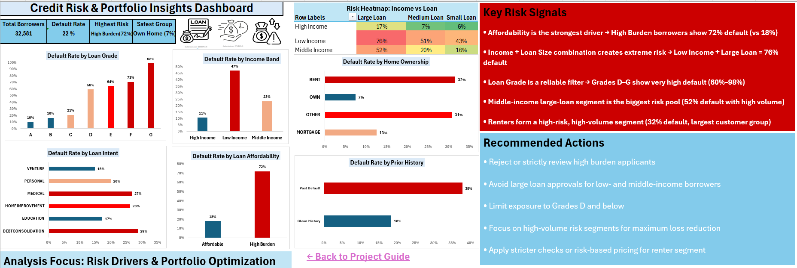

# 📊 Credit Risk & Portfolio Analysis
Author: **Nancy Gupta**  
Role: **Aspiring Data Analyst**

📫 Connect with me on LinkedIn: [Nancy Gupta](https://www.linkedin.com/in/nancy-gupta-5a8286331)

---
## 🔹Overview
This project analyzes a dataset of 32,000+ borrowers to identify key drivers of loan default risk and support better lending decisions.

---

## 🔹Business Problem
Lenders need to understand which customers are likely to default in order to reduce losses and improve portfolio performance.

---
## Dashboard Preview

---
## 🔹Key Insights
- High burden borrowers show 72% default rate
- Low income + large loan segment reaches 76% default
- Loan grades D–G represent high-risk portfolio
- Risk increases significantly when income and loan size interact

  ---

## 🔹Tools Used
- Microsoft Excel
- Pivot Tables
- Data Cleaning & Feature Engineering
- Data Visualization
  
---
## 🔹 Project Files
- Raw Dataset → Csv file (.csv)
- Dashboard Preview → PNG Image (.png)
- All analysis and dashboard → Excel file (.xlsx)

## 🔹Output
A decision-focused dashboard highlighting risk drivers and actionable business insights.

